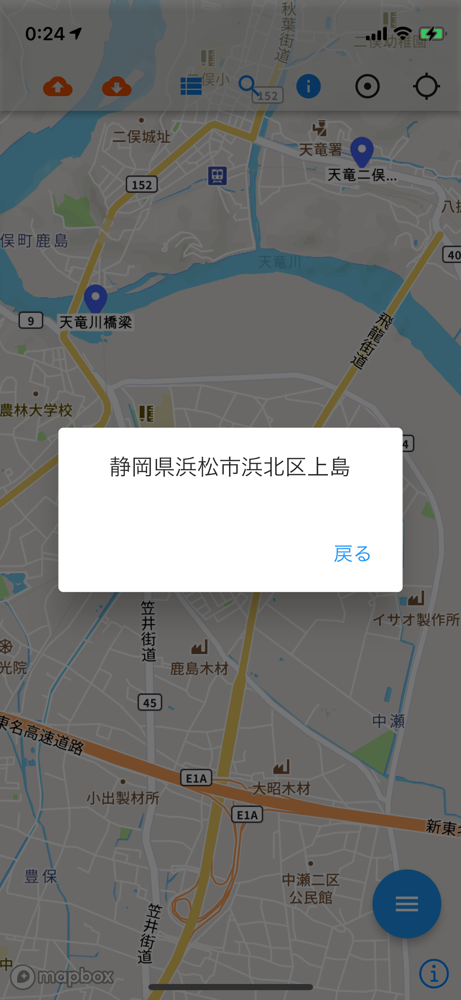

# maptool

## Explanation（Blog / 説明記事）

 - https://qiita.com/hmatsu47/items/b98ef4c1a87cc0ec415d
 - https://zenn.dev/hmatsu47/articles/846c3186f5b4fe
 - https://zenn.dev/hmatsu47/articles/9102fb79a99a98
 - https://zenn.dev/hmatsu47/articles/e81bf3c2bf00f8
 - https://qiita.com/hmatsu47/items/e4f7e310e88376d54009

**In Addition to:**（追加した機能）

 - Modify the detail information about pin.（ピンの詳細情報変更）
 - Take photographs (related to pin).（ピンに関連する写真撮影）
 - List all pins.（ピン一覧）
 - Search pins (with keywords).（ピンのキーワード検索）
 - Reverse Geocoding.（逆ジオコーディング：画面の中心位置の地名表示・ピンの都道府県名＋市区町村名表示）
 - Geocoding.（ジオコーディング：地名検索）
 - Add picture(s) from Image garelly.（ギャラリーからの写真・画像追加）
 - Backup data to AWS.（AWS へデータバックアップ）
   - DB data to DynamoDB.（ピンの詳細情報）
   - Photographs / Pictures to S3 Bucket.（写真・画像）
 - Restore data from AWS.（AWS からデータリストア）
 - Remove backup data on AWS.（不要バックアップデータ削除）

**In development:**（開発中の機能）

 - Improve configuration handling.（外部 API などの設定管理の改善）



## Settings etc.（開発環境の設定情報など）

 - **Create Mapbox Style**

   - https://studio.mapbox.com/

 - **Run '`flutter create maptool`'**

 - **Edit '`pubspec.yaml`'** ( Relevant part only )

```yaml:pubspec.yaml
dependencies:
  flutter:
    sdk: flutter
  mapbox_gl: ^0.13.0
  location: ^4.3.0
  gap: ^2.0.0
  sqflite: ^2.0.0+4
  image_picker: ^0.8.4+3
  cross_file: ^0.3.2
  image_gallery_saver: ^1.7.1
  path_provider: ^2.0.6
  http: ^0.13.4
  amplify_flutter: ^0.2.6
  amplify_api: ^0.2.6
  minio: ^3.0.0
```

 - **Edit '`android/build.gradle`'** ( for Android / in `allprojects` -> `repositories` )

```json:build.gradle
        maven {
            url 'https://api.mapbox.com/downloads/v2/releases/maven'
            authentication {
            basic(BasicAuthentication)
        }
        credentials {
            // Do not change the username below.
            // This should always be `mapbox` (not your username). 
            username = 'mapbox'
            // Use the secret token you stored in gradle.properties as the password
            password = project.properties['MAPBOX_DOWNLOADS_TOKEN'] ?: ""
            }
        }
```

 - **Edit '`android/app/build.gradle`'** ( for Android / in `android` -> `defaultConfig` )

```json:build.gradle
        minSdkVersion 21
        multiDexEnabled true
```

 - **Edit '`android/app/build.gradle`'** ( for Android / in `android` )

```json:build.gradle
    buildTypes {
        release {
            // other configs
            ndk {
                abiFilters 'armeabi-v7a','arm64-v8a','x86_64', 'x86'
            }
        }
    }
```

 - **Edit '`android/app/src/AndroidManifest.xml`'** ( for Android / Relevant part only )

```xml:AndroidManifest.xml
   <application
        android:label="maptool"
        android:icon="@mipmap/ic_launcher"
        android:requestLegacyExternalStorage="true">
```

```xml:AndroidManifest.xml
        <meta-data
            android:name="com.mapbox.token"
            android:value="[Mapbox Access Token here]"
            />
```

 - **Edit '`android/gradle.properties`'** ( for Android / Relevant part only )

```text:gradle.properties
MAPBOX_DOWNLOADS_TOKEN=[Mapbox Secret Token here]
```

 - **Add `Environment Variable(s)`** ( for Android )

```sh:.zshrc
export SDK_REGISTRY_TOKEN="[Mapbox Secret Token here]"
```

 - **Edit '`ios/Podfile`'** ( for iOS / Relevant part only )

```ruby:
# Uncomment this line to define a global platform for your project
platform :ios, '13.0'
```

 - **Edit '`ios/Runner/Info.plist`'** ( for iOS / Relevant part only )

```xml:
	<key>NSLocationAlwaysUsageDescription</key>
	<string>Your location is required for this app</string>
	<key>NSLocationWhenInUseUsageDescription</key>
	<string>Your location is required for this app</string>
	<key>NSPhotoLibraryUsageDescription</key>
	<string>This app requires to access your photo library</string>
	<key>NSCameraUsageDescription</key>
	<string>This app requires to add file to your camera</string>
	<key>NSMicrophoneUsageDescription</key>
	<string>This app requires to add file to your photo library your microphone</string>
	<key>MGLMapboxAccessToken</key>
	<string>[Mapbox Access Token here]</string>
	<key>UISupportsDocumentBrowser</key>
	<true/>
	<key>LSSupportsOpeningDocumentsInPlace</key>
	<true/>
```

 - **Edit '`ios/Runner/Info.plist`'** ( for iOS Debug Environments / Relevant part only )

```xml:
	<key>NSBonjourServices</key>
	<array>
		<string>_dartobservatory._tcp.</string>
	</array>
```

 - **Edit '`/Users/xxx/.netrc`'** ( Relevant part only )

```sh:.netrc
machine api.mapbox.com
login mapbox
password [Mapbox Secret Token here]
```

 - **Set Amplify Flutter CLI config**

(See https://docs.amplify.aws/lib/project-setup/prereq/q/platform/flutter/ )

```sh:
npm install -g @aws-amplify/cli
```

```sh:
amplify configure
```

 - **Run '`amplify init`' & '`flutter pub get`'**

```sh:
amplify init
```

```sh:
flutter pub get
```

 - **Create DynamoDB tables**

```sh:
amplify add storage
```

 - Add 3 tables
   - backupSet (backupSet-maptool)
     - title : String (Partition Key)
   - backupSymbolInfo (backupSymbolInfo-maptool)
     - backupTitle : String (Partition Key)
     - id : Number (Sort Key)
   - backupPicture (backupPicture-maptool)
     - backupTitle : String (Partition Key)
     - id : Number (Sort Key)

```sh:
amplify push
```

 - After creation, change capacity mode to On-Demand.

 - **Create Lambda Functions**

```sh:
amplify add function
```

 - Add 3 tables
   - backupSet (backupSet-maptool)
     - [amplify/backend/function/backupSet/src/index.py](amplify/backend/function/backupSet/src/index.py)
   - backupSymbolInfo (backupSymbolInfo-maptool)
     - [amplify/backend/function/backupSymbolInfo/src/index.py](amplify/backend/function/backupSymbolInfo/src/index.py)
   - backupPicture (backupPicture-maptool)
     - [amplify/backend/function/backupPicture/src/index.py](amplify/backend/function/backupPicture/src/index.py)

```sh:
amplify push
```

 - After creation, modify & adjust IAM Roles (Policies).

 - lambda-execution-policy(BackupSet)

```json:lambda-execution-policy(BackupSet)
{
    "Version": "2012-10-17",
    "Statement": [
        {
            "Sid": "VisualEditor0",
            "Effect": "Allow",
            "Action": "dynamodb:ListTables",
            "Resource": "*"
        },
        {
            "Sid": "VisualEditor1",
            "Effect": "Allow",
            "Action": [
                "logs:CreateLogStream",
                "dynamodb:PutItem",
                "dynamodb:DeleteItem",
                "dynamodb:GetItem",
                "dynamodb:Scan",
                "dynamodb:Query",
                "dynamodb:UpdateItem",
                "logs:CreateLogGroup",
                "logs:PutLogEvents"
            ],
            "Resource": [
                "arn:aws:logs:ap-northeast-1:[Account ID]:log-group:/aws/lambda/backupSet-maptool:log-stream:*",
                "arn:aws:dynamodb:ap-northeast-1:[Account ID]:table/backupSet-maptool"
            ]
        }
    ]
}
```

 - lambda-execution-policy(BackupSymbolInfo)

```json:lambda-execution-policy(BackupSymbolInfo)
{
    "Version": "2012-10-17",
    "Statement": [
        {
            "Sid": "VisualEditor0",
            "Effect": "Allow",
            "Action": "dynamodb:ListTables",
            "Resource": "*"
        },
        {
            "Sid": "VisualEditor1",
            "Effect": "Allow",
            "Action": [
                "logs:CreateLogStream",
                "dynamodb:BatchWriteItem",
                "dynamodb:PutItem",
                "dynamodb:DeleteItem",
                "dynamodb:GetItem",
                "dynamodb:Scan",
                "dynamodb:Query",
                "dynamodb:UpdateItem",
                "logs:CreateLogGroup",
                "logs:PutLogEvents"
            ],
            "Resource": [
                "arn:aws:logs:ap-northeast-1:[Account ID]:log-group:/aws/lambda/backupPicture-maptool:log-stream:*",
                "arn:aws:dynamodb:ap-northeast-1:[Account ID]:table/backupPicture-maptool"
            ]
        }
    ]
}
```

 - lambda-execution-policy(BackupPicture)

```json:lambda-execution-policy(BackupPicture)
{
    "Version": "2012-10-17",
    "Statement": [
        {
            "Sid": "VisualEditor0",
            "Effect": "Allow",
            "Action": "dynamodb:ListTables",
            "Resource": "*"
        },
        {
            "Sid": "VisualEditor1",
            "Effect": "Allow",
            "Action": [
                "logs:CreateLogStream",
                "dynamodb:PutItem",
                "dynamodb:DeleteItem",
                "dynamodb:GetItem",
                "dynamodb:Scan",
                "dynamodb:Query",
                "dynamodb:UpdateItem",
                "logs:CreateLogGroup",
                "logs:PutLogEvents"
            ],
            "Resource": [
                "arn:aws:logs:ap-northeast-1:[Account ID]:log-group:/aws/lambda/backupSet-maptool:log-stream:*",
                "arn:aws:dynamodb:ap-northeast-1:[Account ID]:table/backupSet-maptool"
            ]
        }
    ]
}
```

 - **Create API Gateway (API & resource)**

   - Create API
     - maptool
   - Create API Key
     - maptool
   - Create Usage Plan & Stage
     - maptool / prod
   - Create Resources
     - /backupsets
       - Lambda Function : backupSet-maptool
     - /backupsymbolinfos
       - Lambda Function : backupSymbolInfo-maptool
     - /backuppictures
       - Lambda Function : backupPicture-maptool
   - Create Method (to each Resources)
     - POST
       - Authorization : NONE
       - API Key Required : true
   - Deploy API

 - **Create S3 bucket & IAM user (Access key / Secret access key)

   - Create S3 bucket
     - Block all public access : Off
   - Create IAM user
     - AWS credential type : Access key - Programmatic access
     - Attach Role (Policy)

```json:Role(Policy)
{
    "Version": "2012-10-17",
    "Statement": [
        {
            "Sid": "VisualEditor0",
            "Effect": "Allow",
            "Action": [
                "s3:PutObject",
                "s3:GetObject",
                "s3:ListBucket",
                "s3:DeleteObject"
            ],
            "Resource": [
                "arn:aws:s3:::[Bucket name]/*",
                "arn:aws:s3:::[Bucket name]"
            ]
        },
        {
            "Sid": "VisualEditor1",
            "Effect": "Allow",
            "Action": "s3:ListAllMyBuckets",
            "Resource": "*"
        }
    ]
}
```

 - **Edit (Create) `.dart` Files**

   - [lib/main.dart](lib/main.dart)
   - [lib/map_page.dart](lib/map_page.dart)
   - [lib/display_symbol_info_page.dart](lib/display_symbol_info_page.dart)
   - [lib/edit_symbol_info_page.dart](lib/edit_symbol_info_page.dart)
   - [lib/display_picture_page.dart](lib/display_picture_page.dart)
   - [lib/list_symbol_page.dart](lib/list_symbol_page.dart)
   - [lib/search_keyword_page.dart](lib/search_keyword_page.dart)
   - [lib/restore_data_page.dart](lib/restore_data_page.dart)

 - **Add Amplify application config**
   - [lib/amplifyconfiguration.dart](lib/amplifyconfiguration.dart)
