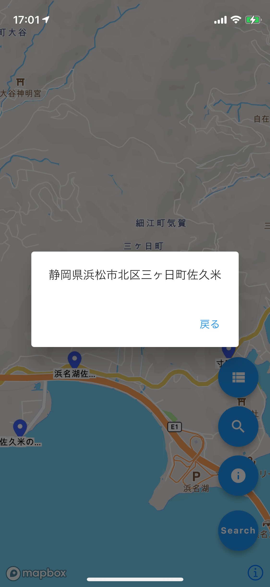

# maptool

## Explanation（Blog / 説明記事）

 - https://qiita.com/hmatsu47/items/b98ef4c1a87cc0ec415d
 - https://zenn.dev/hmatsu47/articles/846c3186f5b4fe
 - https://zenn.dev/hmatsu47/articles/9102fb79a99a98
 - https://zenn.dev/hmatsu47/articles/e81bf3c2bf00f8

**In development:**（※開発中の機能）

 - Modify the detail information about pin.（ピンの詳細情報変更）
 - Take photographs (related to pin).（ピンに関連する写真撮影）



## Settings etc.（開発環境の設定情報など）

 - **Create Mapbox Style**

   - https://studio.mapbox.com/

 - **Run '`flutter create maptool`'**

 - **Edit '`pubspec.yaml`'** ( Relevant part only )

```yaml:pubspec.yaml
dependencies:
  flutter:
    sdk: flutter
  mapbox_gl: ^0.12.0
  location: ^4.3.0
  gap: ^2.0.0
  sqflite: ^2.0.0+4
  image_picker: ^0.8.4+2
  cross_file: ^0.3.1+5
  image_gallery_saver: '^1.7.0'
  path_provider: ^2.0.5

dependency_overrides:
  mapbox_gl:
    git:
      url: https://github.com/tobrun/flutter-mapbox-gl.git
  mapbox_gl_platform_interface:
    git:
      url: https://github.com/tobrun/flutter-mapbox-gl.git
      path: mapbox_gl_platform_interface
  mapbox_gl_web:
    git:
      url: https://github.com/tobrun/flutter-mapbox-gl.git
      path: mapbox_gl_web
```

 - **Edit '`android/build.gradle`'** ( for Android / in `android` -> `defaultConfig` )

```json:build.gradle
        minSdkVersion 20
        multiDexEnabled true
```

 - **Edit '`android/app/src/AndroidManifest.xml`'** ( for Android / Relevant part only )

```xml:AndroidManifest.xml
   <application
        android:label="maptool"
        android:icon="@mipmap/ic_launcher"
        android:requestLegacyExternalStorage="true">
```

```xml:AndroidManifest.xml
        <meta-data
            android:name="com.mapbox.token"
            android:value="[Mapbox Access Token or Secret Token here]"
            />
```

 - **Add `Environment Variable(s)`** ( for Android )

```sh:.zshrc
export SDK_REGISTRY_TOKEN="[Mapbox Access Token or Secret Token here]"
```

 - **Edit '`ios/Runner/Info.plist`'** ( for iOS / Relevant part only )

```xml:
	<key>NSLocationAlwaysUsageDescription</key>
	<string>Your location is required for this app</string>
	<key>NSLocationWhenInUseUsageDescription</key>
	<string>Your location is required for this app</string>
	<key>NSPhotoLibraryUsageDescription</key>
	<string>This app requires to access your photo library</string>
	<key>NSCameraUsageDescription</key>
	<string>This app requires to add file to your camera</string>
	<key>NSMicrophoneUsageDescription</key>
	<string>This app requires to add file to your photo library your microphone</string>
	<key>MGLMapboxAccessToken</key>
	<string>[Mapbox Access Token or Secret Token here]</string>
	<key>UISupportsDocumentBrowser</key>
	<true/>
	<key>LSSupportsOpeningDocumentsInPlace</key>
	<true/>
```

 - **Edit '`ios/Runner/Info.plist`'** ( for iOS Debug Environments / Relevant part only )

```xml:
	<key>NSBonjourServices</key>
	<array>
		<string>_dartobservatory._tcp.</string>
	</array>
```

 - **Edit '`/Users/xxx/.netrc`'** ( Relevant part only )

```sh:.netrc
machine api.mapbox.com
login mapbox
password [Mapbox Access Token or Secret Token here]
```

 - **Run '`flutter pub get`'**

 - **Edit (Create) `.dart` Files**

    - [lib/main.dart](lib/main.dart)
    - [lib/map_page.dart](lib/map_page.dart)
    - [lib/display_symbol_info_page.dart](lib/display_symbol_info_page.dart)
    - [lib/edit_symbol_info_page.dart](lib/edit_symbol_info_page.dart)
